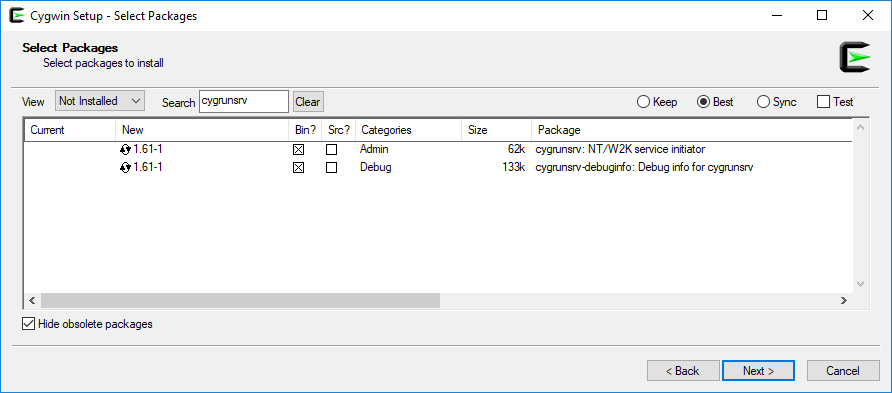

# OccamSmart Packet Forwarder for LoRaWAN

The OccamSmart Packet Forwarder implements a LoRaWAN 1.0 Class A gateway based on the [OccamSmart mPCIe Smart Gateway Card](https://www.occamsmart.com/mpcie-smart-gateway-card/).

# Getting Started

Binaries are currently available for Ubuntu 16.04 and Windows 10 on the [Releases](https://github.com/occamsmart/packet_forwarder/releases) page. 

## Installation

### Ubuntu 16.04

1. Download the [latest release](https://github.com/occamsmart/packet_forwarder/releases) for Ubuntu 16.04.
2. (Optional) If you would like to install a systemd service file for the Packet Forwarder, run the `install_service.sh` script as root, e.g.

    sudo ./install_service.sh

3. Proceed to [Configuration](#Configuration).

### Windows

1. Download and extract the [latest release](https://github.com/occamsmart/packet_forwarder/releases) for Windows 10.

2. Download the [Cygwin x86_64 setup](https://cygwin.com/setup-x86_64.exe).

3. (Optional) If you would like to install the Packet Forwarder as a Windows Service, you will need to install the cygrunsrv package. On the **Select Packages** screen of the Cygwin setup, set the **View** to *Not Installed*, and search for `cygrunsrv`. Set the package to be installed by clicking the circular arrow symbol under **New**.


4. (Optional) To install the service, run the `install_service.bat` script. The service can then be managed using the Windows Services app or [using Powershell](https://docs.microsoft.com/en-us/powershell/scripting/getting-started/cookbooks/managing-services). To uninstall the service, run `uninstall_service.bat`.

5. Complete the Cygwin setup, and all of the necessary dependencies should be installed. 

6. Add the Cygwin bin directory, e.g. `C:\cygwin\bin`, to your Path.

7. Now you may continue to [Configuration](#Configuration).

## Configuration

To configure the Packet Forwarder to properly connect to the OccamSmart Smart Gateway Card, the configuration file `global_conf.json` (`/var/lib/occamsmart/global_conf.json` if the service was installed) will need to be edited. 

1. `serial_device_name`

    ### Ubuntu 16.04

    On Ubuntu, the Gateway Card often enumerates as `/dev/ttyACM0`, which should be the default in `global_conf.json`. If the Packet Forwarder runs successfully, no configuration of this option is necessary

    In the case that it does not, to locate the correct value for the `serial_device_name` option look in `/dev/serial/by-id`:

        ls  /dev/serial/by-id

    The usb serial device will enumerate as something similar to 

    usb-Microchip_Technology_Inc._MCP2200_USB_Serial_Port_Emulator_SOMEIDENTIFIER-if00

    So the `serial_device_name` in this case would be   
        
        /dev/serial/by-id/usb-Microchip_Technology_Inc._MCP2200_USB_Serial_Port_Emulator_SOMEIDENTIFIER-if00

    ```
    {
        "gateway_conf": {
            "serial_device_name":   "/dev/serial/by-id/usb-Microchip_Technology_Inc._MCP2200_USB_Serial_Port_Emulator_SOMEIDENTIFIER-if00",
            "gateway_ID": "ABCDEF000000000",
            ...
        },
        ...
    }
    ```

    ### Windows 10

    On Windows 10, the serial device name can be found by opening **Device Manager**, and expanding **Ports (COM & LPT)**. Look for a *USB Serial Port*.

    Because Windows numbers COM ports starting from `COM1`, while Cygwin numbers serial ttys  starting from `/dev/ttyS0`, `COM1` will actually be `/dev/ttyS0`, `COM2` will be `/dev/ttyS1`, etc.

    So for example, if the Gateway Board has enumerated as `COM4`, your `serial_device_name` should look as follows:

    ```
    {
        "gateway_conf": {
            "serial_device_name":   "/dev/ttyS3",
            "gateway_ID": "ABCDEF000000000",
            ...
        },
        ...
    }
    ```

2. Gateway ID: You should configure a unique 16 hexadecimal digit Gateway ID for your gateway, e.g.

    ```
    {
        "gateway_conf": {
            ...
            "gateway_ID": "1234ABCD1234ABCD",
            ...
        },
        ...
    }
    ```    
3. Frequency configuration

    The Smart Gateway Board is based on the Semtech SX1301, which contains two Radios, `radio_0` and `radio_1`, and 8 channels, `chan_multiSF_0` through `chan_multiSF_7`, each of which can be attached to one of the two radios.

    Each of the two radios is specified in the config file as below:

    ``` json
    { 
        "SX1301_conf": {
            ...
            "radio_0": {
                "enable": true,
                "type": "SX1257"
                "freq": 902700000, /* Center frequency (Hz) */
                "rssi_offset": -166.0,
                "tx_enable": true,
                "tx_freq_min": 902000000,
                "tx_freq_max": 928000000
            },
            ...
        }
    }
    ```
    The most important field is the `freq` field, which determines the base frequency in Hz which each attached channel's offset is added to.

    The channels are specified as below:

    ``` json
    { 
        "SX1301_conf": {
            ...
            "chan_multiSF_3": {
                /* Lora MAC channel, 125kHz, all SF, 902.9 MHz */
                "enable": true,
                "radio": 0,
                "if": 200000
            },
            ...
        }
    }
    ```
    The `if` field specifies the offset from the center frequency of the radio the channel is attached to. For instance, if `radio_0` has `freq` set to `902700000`, and `chan_multiSF_3` has `if` set to `200000`, then channel 3 will receive all LoRa packets sent at `902700000 + 200000 = 902900000 Hz`, (902.3 MHz).

# License

This software is licensed under the Apache 2.0 License, with some components licensed under the BSD or MIT licenses. See the [LICENSE](LICENSE) file.
